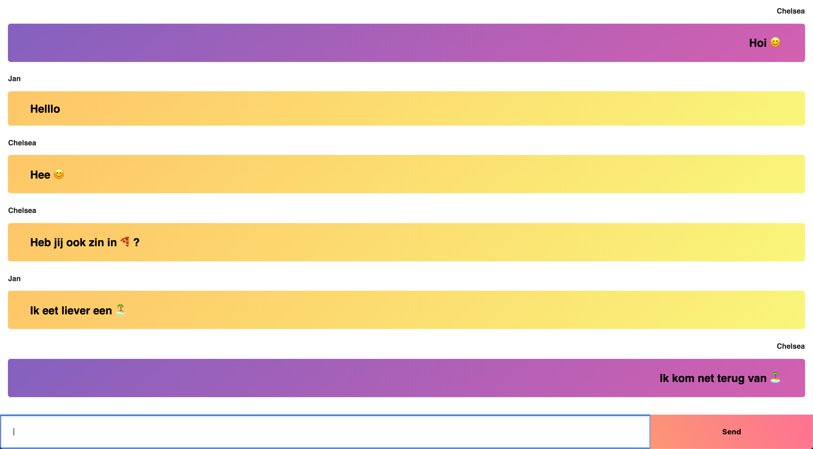

# Real-Time Web | Crazy chatbox? 🤷‍

**During the first week of this course I learned how to build an chatbox with socket.io. The purpose of this chatbox was to experiment and add a crazy feature. In this case I build something that replaces words with some emoji's. But it's main feature is that the application is real-time 🤓**

[The application can be found here](https://real-time-web-chelsea.herokuapp.com/)



## Table of Contents
* **[How to install](#how-to-install)**
* **[How to use](#how-to-use)**
* **[Features](#features)**
* **[Week 1](#week-1)**
* **[Week 2](#week-2)**
* **[Week 3](#week-3)**
* **[Checklist](#checklist)**
* **[Resources](#resources)**
* **[License](#license)**

## How to install

Before installing make sure you have installed node.js and npm.
Choose or make a new directory.
Load the template into your directory.

```bash
git clone https://github.com/chelseadoeleman/real-time-web-1819.git
```

Make sure you are in the right directory 
```bash
cd real-time-web-1819
```

Check if you have the latest version of npm.
Install the dependencies in [package.json](./package.json)
```bash
npm install
```

## How to use

In this application you are able to open the chatbox and chat with other people who are also using the chatbox. Firstly you have to choose a nickname, which can we whatever you like! Then you are able to chat, by typing a message in the input field. Don't forget to press send (or enter, for the ones who figured that one out)! The fun part is that some words will be replaced by emoji's, to make your text messages more fun! I guess...


## Features

Words will be replaced with emoji's on the server, however assigning the username with unique id's will be done on the client. Here is an overview with words that will be replaced with n emoji.
```js

const emoticons = [
    {name: 'api', emoticon: '🐒'},
    {name: 'boom', emoticon: '🌳'},
    {name: 'zon', emoticon: '☀️'},
    {name: 'nederland', emoticon: '🇳🇱'},
    {name: 'vakantie', emoticon: '🏝'},
    {name: 'sneeuw', emoticon: '❄️'},
    {name: 'ijs', emoticon: '🍦'},
    {name: 'perzik', emoticon: '🍑'},
    {name: 'banaan', emoticon: '🏝'},
    {name: 'hou van jou', emoticon: '❤️'},
    {name: 'auto', emoticon: '🚗'},
    {name: 'vliegtuig', emoticon: '✈️'},
    {name: 'voetbal', emoticon: '⚽️'},
    {name: 'pizza', emoticon: '🍕'},
    {name: 'banaan', emoticon: '🍌'},
    {name: 'wintersport', emoticon: '⛷ 🏂'},
    {name: 'tennis', emoticon: '🎾'},
    {name: 'winter', emoticon: '☃️'},
    {name: 'lente', emoticon: '🌸'},
    {name: 'zomer', emoticon: '🌴'},
    {name: 'herfst', emoticon: '🍄'}
]

```
What I learned about sockets is that sending an ```io.emit``` will send an message to everyone and ```broadcast``` will send it to any other person, but the person the data is coming from (client). In the end I found it hard to come up with features to add to the application so I left it here. It will be nice to have something like an database behind it, so that the user will automatically come back in the chat as the person they were before. So their session isn't completely lost when they refresh the page. 


## Week 1
<details>
  <summary>What did I do in Week 1</summary>
  See main readme.
</details>

## Week 2
<details>
  <summary>What did I do in Week 2</summary>
  We're not there yet, coming soon...
</details>

## Week 3
<details>
  <summary>What did I do in Week 3</summary>
  We're not there yet, coming soon...
</details>


## Checklist
- [X] Setting up server with node.js and express
- [X] Implement session with socket.io on server
- [X] Replace words with emoji's
- [X] Create username in chat
- [X] Create unique users
- [X] Divide code between server and client
- [ ] Come up and create more features on the server
- [ ] Set up localstorage with users and messages

## Resources

## License
This repository is licensed as [MIT](LICENSE) by [Chelsea Doeleman](https://github.com/chelseadoeleman).

[socket.io]:https://socket.io/
[socket.io chat]:https://socket.io/demos/chat/
[npm]:https://docs.npmjs.com/cli/run-script
[markdown]:https://guides.github.com/features/mastering-markdown/
[heroku]:https://www.heroku.com/