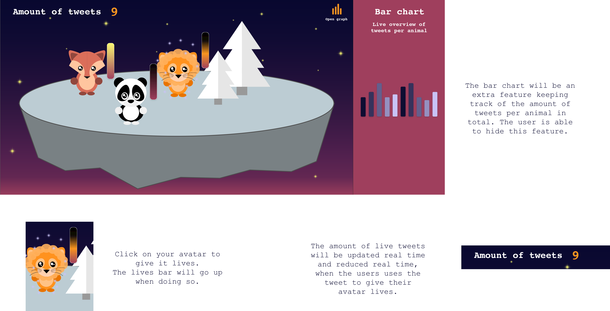
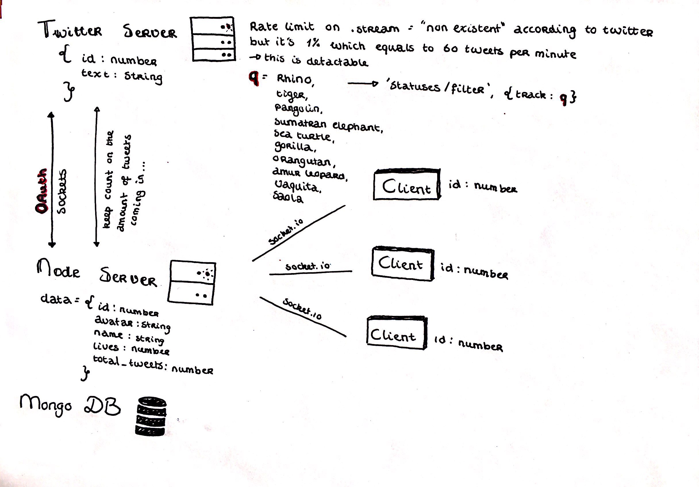
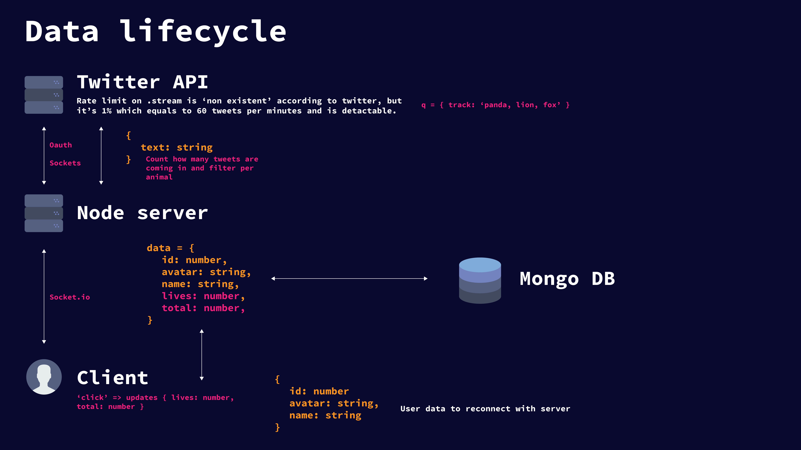

# Real-Time Web | Animal Crossing x Twitter ‍🐘

**For this course I have to build an real-time application that get's data from an external server. This can be an API with static data or an API with real-time data. I chose the real-time API twitter. The user should also be able interact on a page real-time, where data get's stored in a database or an data object.**

## Table of Contents
* **[How to install](#how-to-install)**
* **[Concept](#concept)**
* **[The Twitter API](#the-twitter-api)**
* **[Data lifecycle](#data-lifecycle)**
* **[Week 1](#week-1)**
* **[Week 2](#week-2)**
* **[Week 3](#week-3)**
* **[Checklist](#checklist)**
* **[Resources](#resources)**
* **[License](#license)**

## How to install 

Before installing make sure you have installed node.js and npm.
Choose or make a new directory.
Load the template into your directory.

```bash
git clone https://github.com/chelseadoeleman/real-time-web-1819.git
```

Make sure you are in the right directory 
```bash
cd real-time-web-1819
```

Check if you have the latest version of npm.
Install the dependencies in [package.json](./package.json)
```bash
npm install
```

## Concept

I will try to describe this in the best way I can, but it might be a bit vague. I created an application where the user is able to create an avatar and keep it alive by giving it some "food". However there is catch, the user is only able to give food to their avatar based on a certain amount of tweets about the top 10 most endangered animals as of right now. 

**Top 10 most endangered animals**
1. Amur leopard
2. Gorillas
3. Sea turtles
4. Orangutan
5. Sumatran elephant
6. Saola
7. Vaquita
8. Tiger
9. Rhinos
10. Pangolin

Every time someone tweets is about one of these endagered animals the user is able to give their avatar healthpoints to keep it alive and happy! But you have to be fast, because other players also want to keep their animals alive! After 30 seconds the lives bar will be lowered, reducing the amount of lives your animal has. This application is made to create more awareness for these animals in the hopes more people will tweet about them. In extra addition if I have some time left I want to create a bar chart in D3 with all the animals to see which animal get's the more awareness of them all.

Due to time restrictions I didn't make any avatars based on the top 10 most endangered animals.



An 'sketch' of the most important screen in the application.

## The twitter API

The twitter API makes use of an OAuth authorization. Personally I don't intent to use personal account information for my application. The twitter API also makes use of sockets to get real-time data. By creating a developers account an creating an app I was able to get all the specific API keys to get the right data from the API. This is an example of all the data from a specific tweet about rhino's. The data I specifically want is ```text``` differentiate certain tweets about a specific animals. Because you're not able to create multiple streams.

```
{
created_at: 'Thu Apr 18 21:45:48 +0000 2019',
  id: 1118994058628587500,
  id_str: '1118994058628587520',
  text:
   'PLAIN TALK\nRHINO fiscal policies that will not play well with the conservative Republican base.',
  source:
   '<a href="http://twitter.com" rel="nofollow">Twitter Web Client</a>',
  truncated: false,
  in_reply_to_status_id: null,
  in_reply_to_status_id_str: null,
  in_reply_to_user_id: null,
  in_reply_to_user_id_str: null,
  in_reply_to_screen_name: null,
  user:
   { id: 853018218503454700,
     id_str: '853018218503454720',
     name: '_theOutpost_',
     screen_name: '_theOutpost_',
     location: 'Montana, USA',
     url: null,
     description:
      'News from a Conservative Perspective. Traditional/Unorthodox/   Civil/Irreverent. Editorials. Weekly Book Recs. More. Celebrating Our American Culture.',
     translator_type: 'none',
     protected: false,
     verified: false,
     followers_count: 25430,
     friends_count: 25885,
     listed_count: 7,
     favourites_count: 16410,
     statuses_count: 60934,
     created_at: 'Fri Apr 14 22:52:46 +0000 2017',
     utc_offset: null,
     time_zone: null,
     geo_enabled: false,
     lang: 'en',
     contributors_enabled: false,
     is_translator: false,
     profile_background_color: 'F5F8FA',
     profile_background_image_url: '',
     profile_background_image_url_https: '',
     profile_background_tile: false,
     profile_link_color: '1DA1F2',
     profile_sidebar_border_color: 'C0DEED',
     profile_sidebar_fill_color: 'DDEEF6',
     profile_text_color: '333333',
     profile_use_background_image: true,
     profile_image_url:
      'http://pbs.twimg.com/profile_images/1012191514225623041/JkEcUxe5_normal.jpg',
     profile_image_url_https:
      'https://pbs.twimg.com/profile_images/1012191514225623041/JkEcUxe5_normal.jpg',
     profile_banner_url:
      'https://pbs.twimg.com/profile_banners/853018218503454720/1530160155',
     default_profile: true,
     default_profile_image: false,
     following: null,
     follow_request_sent: null,
     notifications: null },
  geo: null,
  coordinates: null,
  place: null,
  contributors: null,
  quoted_status_id: 1118944845412876300,
  quoted_status_id_str: '1118944845412876289',
  quoted_status:
}

```


## Data lifecycle

<details>
  <summary>Version 1</summary>
  
This is kinda how the data will flow through the application, but it probably will need some tweeking. In this overview a database is included, but maybe due to time management, this will not be my main priority to fix in the application, thus I will be storing the data in a variable/ json file for now.



</details>
<details open>
  <summary>Version 2</summary>



</details>

## Week 1
<details>
  <summary>What did I do in Week 1</summary>

# Real-Time Web | Crazy chatbox? 🤷‍

**During the first week of this course I learned how to build an chatbox with socket.io. The purpose of this chatbox was to experiment and add a crazy feature. In this case I build something that replaces words with some emoji's. But it's main feature is that the application is real-time 🤓**

[The application can be found here](https://real-time-web-chelsea.herokuapp.com/)


## Table of Contents
* **[How to use](#how-to-use)**
* **[Features](#features)**
* **[Checklist](#checklist)**

## How to use

In this application you are able to open the chatbox and chat with other people who are also using the chatbox. Firstly you have to choose a nickname, which can we whatever you like! Then you are able to chat, by typing a message in the input field. Don't forget to press send (or enter, for the ones who figured that one out)! The fun part is that some words will be replaced by emoji's, to make your text messages more fun! I guess...


## Features

Words will be replaced with emoji's on the server, however assigning the username with unique id's will be done on the client. Here is an overview with words that will be replaced with n emoji.
```js

const emoticons = [
    {name: 'api', emoticon: '🐒'},
    {name: 'boom', emoticon: '🌳'},
    {name: 'zon', emoticon: '☀️'},
    {name: 'nederland', emoticon: '🇳🇱'},
    {name: 'vakantie', emoticon: '🏝'},
    {name: 'sneeuw', emoticon: '❄️'},
    {name: 'ijs', emoticon: '🍦'},
    {name: 'perzik', emoticon: '🍑'},
    {name: 'banaan', emoticon: '🏝'},
    {name: 'hou van jou', emoticon: '❤️'},
    {name: 'auto', emoticon: '🚗'},
    {name: 'vliegtuig', emoticon: '✈️'},
    {name: 'voetbal', emoticon: '⚽️'},
    {name: 'pizza', emoticon: '🍕'},
    {name: 'banaan', emoticon: '🍌'},
    {name: 'wintersport', emoticon: '⛷ 🏂'},
    {name: 'tennis', emoticon: '🎾'},
    {name: 'winter', emoticon: '☃️'},
    {name: 'lente', emoticon: '🌸'},
    {name: 'zomer', emoticon: '🌴'},
    {name: 'herfst', emoticon: '🍄'},
    {name: 'hockey', emoticon: '🏑'},
    {name: 'fietsen', emoticon: '🚲'},
    {name: 'regen', emoticon: '🌧'},
    {name: 'raket', emoticon: '🚀'},
    {name: 'oeps', emoticon: '🙈'},
    {name: 'shit', emoticon: '💩'},
    {name: 'muziek', emoticon: '🎶'},
    {name: 'japan', emoticon: '⛩'},
    {name: 'foto', emoticon: '📸'},
    {name: 'douchen', emoticon: '🛁'},
    {name: 'bier', emoticon: '🍻'},
    {name: 'laptop', emoticon: '💻'}
]

```
What I learned about sockets is that sending an ```io.emit``` will send an message to everyone and ```broadcast``` will send it to any other person, but the person the data is coming from (client). I used state to set the username and an unique user id and to let the user see this in the chat. I used an user id, because people can choose the same nickname/ username and I hadn't had a databse set up yet.

In the end I found it hard to come up with features to add to the application so I left it here. It will be nice to have something like an database behind it, so that the user will automatically come back in the chat as the person they were before. So their session isn't completely lost when they refresh the page.

## Checklist
- [X] Setting up server with node.js and express
- [X] Implement session with socket.io on server
- [X] Replace words with emoji's
- [X] Create username in chat
- [X] Create unique users
- [X] Divide code between server and client
- [ ] Come up and create more features on the server
- [ ] Set up localstorage with users and messages

</details>

## Week 2
<details>
  <summary>What did I do in Week 2</summary>

  ## Concept

  **First concept** 
  

  I want to use the twitter API for real-time data and connect it to the IUCN Red List Api. However I had to ask permission for an accesskey, but I haven't received an answer yet. If I cannot get an accesskey I will just filter all tweets to rhino's to see how much awareness they get. This I want to project on a map with the Mapbox Api. As an extra feature I would like to add an linechart where you can view the amount of tweets on a timeline. If I get to use the IUCN Red List Api the user would also be able to view this linechart for a specific animal.

<hr>

 **Second concept see main Readme** 

## Data lifecycle

This is kinda how the data will flow through the application, but it probably will need some tweeking. In this overview a database is included, but maybe due to time management, this will not be my main priority to fix in the application, thus I will be storing the data in a variable/ json file for now.


## Feedback

I would like to receive some feedback on my data lifecycle, because I still found it quite complicated to make. I also feel like I messed up here and there and it might not be complete yet. I also changed my concept, but wasn't fully approved yet, so I would like to get some feedback on that as well.

* Sharpen concept, continue with animals you made avatars for.
* Is there more user input and how does the user manipulate the data life cycle?
* Add to keep track of specific animal tweets.
* Update data lifecycle.

</details>

## Week 3
<details>
  <summary>What did I do in Week 3</summary>

  <hr>
  <i>We're not there yet, coming soon...</i>
</details>


## Checklist
- [X] Setting up server with node.js and express
- [X] Implement session with socket.io on server
- [X] Create application setup
- [X] Create avatar and nickname
- [X] Get data from Twitter API
- [X] Update count with the Twitter API
- [X] User clicks on animal to update lives
- [X] User is able to update avatar with sockets
- [X] Deploy on Heroku
- [ ] Detect specific animal tweets
- [ ] Add bar graph
- [ ] Add lives bar
- [ ] Delete user on disconnect
- [ ] Keep track of data in a database or external file.
- [ ] Fix styling

## Resources

* [npm](https://docs.npmjs.com/cli/run-script)
* [markdown](https://guides.github.com/features/mastering-markdown/)
* [heroku](https://www.heroku.com/)
* [socket.io](https://socket.io/)
* [socket.io chat](https://socket.io/demos/chat/)
* [socket.io chat tutorial](https://socket.io/get-started/chat/)
* [Gulp](https://gulpjs.com/)
* [Ejs](https://ejs.co/)
* [Nodemon](https://nodemon.io/)
* [Express](https://expressjs.com/)
* [Node](https://nodejs.org/en/)
* [Helmet](https://github.com/helmetjs/helmet)
* [Node-fetch](https://www.npmjs.com/package/node-fetch)

## License
This repository is licensed as [MIT](LICENSE) by [Chelsea Doeleman](https://github.com/chelseadoeleman).
